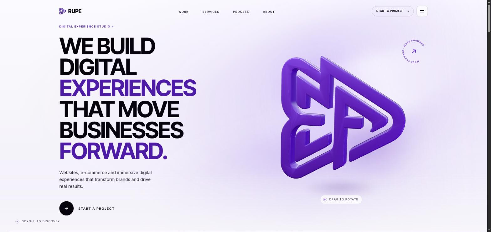
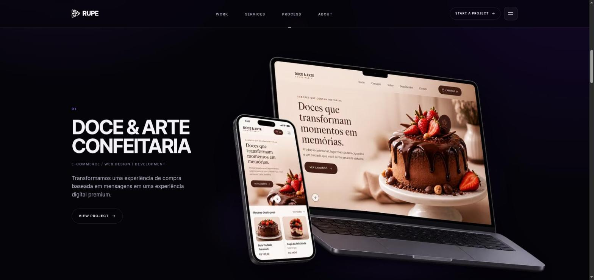

# RUPE — Digital Experience Studio

Single-page site for the RUPE studio, built from the layout reference in `assests/`.
The hero mark is a procedural Three.js reconstruction of the brand symbol — geometry
measured from the source art, not a textured plane or a tilted PNG.

## Run

```bash
npm install
npm run dev        # http://localhost:5173
npm run build      # type-check + production bundle into dist/
npm run preview
npm run logo:trace # re-derive the mark geometry from assests/ (needs python3 + numpy/scipy/PIL/matplotlib)
```

`dev` and `preview` both bind to every interface, so the site is reachable from a phone
on the same network at `http://<your-lan-ip>:5173` — Vite prints the address as
`Network:` on startup.

Responsive checks without resizing the window:
`http://localhost:5173/tools/viewport.html?w=390&h=760` frames the site at any viewport.
It lives outside `public/`, so it never ships in a build.



## Structure

```
src/
  components/   Navbar, Hero, RupeLogo3D, Portfolio, ProjectCase,
                CaseMockup, CaseScreens, Services, Process, About,
                FinalCTA, Footer, RupeMark, ArrowButton
  three/        createRupeLogo.ts · materials.ts · LogoScene.ts · rupeMarkPath.ts (generated)
  hooks/        useSmoothScroll · useReveal · useMagnetic · useMediaQuery · usePrefersReducedMotion
  lib/          gsap.ts (single plugin registration)
  styles/       tokens.css · base.css · ui.css
tools/          logo tracing + verification pipeline (Python) + viewport.html dev harness
docs/           logo-reconstruction.md — how the 3D mark was rebuilt and verified
.img2threejs/   img2threejs pipeline state + sculpt spec
```

Stack: React 19 + TypeScript + Vite, three.js (vanilla, wrapped in a lifecycle class),
GSAP/ScrollTrigger, Lenis, hand-written CSS with design tokens. Stylesheets load
globals first (`main.tsx`) then component CSS, so component rules win the cascade.

## The case mockup

`CaseMockup` presents the Doce & Arte case with the approved composition asset, used
exactly as delivered. The source carries a real cutout alpha — laptop and phone
silhouetted, no rectangular backdrop — so it sits straight on the dark section with no
edge to disguise. Everything the component adds paints *behind* the artwork: an ambient
violet radial, a pool of contact light under the base, and a drop-shadow to ground the
devices. Nothing filters or recolours the image itself.

Motion is scroll-linked, not timed. `useCaseScrollMotion` builds two scrubbed
timelines, each owning a different element so nothing fights for the same `transform`:

- **entrance** — the copy assembles top-down and `.mockup__enter` arrives from
  `translate3d(80px,100px,0) scale(.88) rotate(2deg)` to rest;
- **through** — a three-point arc on `.mockup__drift` (y 50 → 0 → -50, scale .96 → 1 →
  1.03, plus ±2° of rotateX/rotateY inside a 1200px perspective) that keeps running for
  as long as the case holds the screen, with `.mockup__glow` and `.case__copy` on the
  same clock. The copy travels less than the mockup — that difference in rate is the
  depth cue.

`.mockup__tilt` stays independent: a lerped pointer response bounded to ±6px / ±4px and
half a degree.

The live case holds the screen for roughly 53vh through native `position: sticky` plus a
block-level spacer. A sticky element is bounded by its container's *content* box, so the
spacer has to be content — `padding-bottom` shortens the travel instead of lengthening
it. Nothing is pinned and no scroll is intercepted.

`will-change` is applied by each trigger's `onToggle` and handed back when the case stops
animating.

Served as AVIF with a WebP fallback at 768 / 1024 / 1513 widths — 40K on mobile against
the 2MB source. See `public/cases/doce-e-arte/README.md` for the encode recipe.



## The 3D mark

`createRupeLogo()` returns a `THREE.Group`, so the page controls `position`, `rotation`
and `scale` directly; `setMaterial()` reaches the shared material and `dispose()`
releases everything.

It is interactive: drag with a mouse, swipe on a phone, or focus it and use the arrow
keys (Home / Escape resets). Yaw spins freely through a full 360° and beyond, so both
edges and the back of the plate are reachable; pitch keeps a rubber-banded limit because
tipping past it gimbals the Euler order. A flick carries momentum. The mark holds the
angle you leave it at and only settles after 2.6 s of no interaction — and it settles
into the turn it is already in rather than rewinding every rotation you spun through.
Tune `DRAG_YAW_PER_WIDTH`, `PITCH_LIMIT_ABS` and `SPIN_DECAY` in `src/three/LogoScene.ts`. The silhouette comes from `src/three/rupeMarkPath.ts`, generated by
`tools/export_logo.py` and verified at **IoU 0.970** against the source art — the
residual is the antialias fringe of the reference PNG. See `docs/logo-reconstruction.md`.

The same contour data draws the 2D mark in the navbar, footer, About section and final
CTA (`src/components/RupeMark.tsx`), so the flat and extruded marks stay in sync.

Performance: three.js loads on its own chunk after first paint, the frame loop pauses
off screen and on tab hide, DPR is capped at 1.75 (1.5 mobile), and mobile drops to two
lights and a coarser bevel. Under `prefers-reduced-motion` the mark renders once at rest
and the loop stops.

## Placeholders to replace before launch

- **Cases 02 and 03** — `CASES` in `src/components/Portfolio.tsx`, plus
  `PlaceholderMockup` in `src/components/CaseScreens.tsx`.
- **Contact and social** — `hello@example.com` and the `#` social links in
  `src/components/Footer.tsx` and `src/components/FinalCTA.tsx`.

No metrics, results or client names beyond Doce & Arte appear anywhere on the page —
none were supplied, so none were invented.
